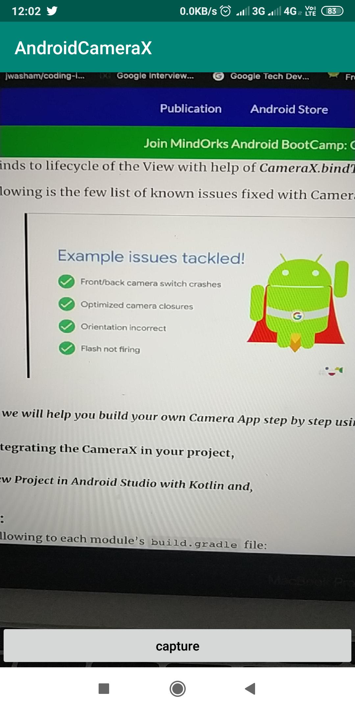

# CameraX  

In Google I/O 2019 , Google added another powerfull tool for camera development in Android development called CameraX as part of Jetpack.

This repository is a part of an article written at [MindOrks Blog](https://blog.mindorks.com/getting-started-with-camerax). 

